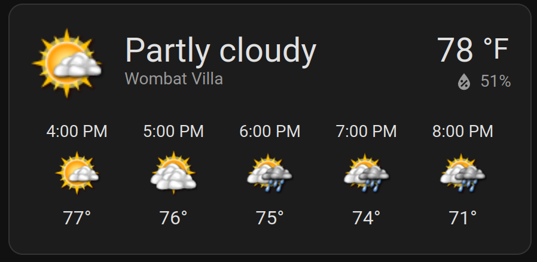
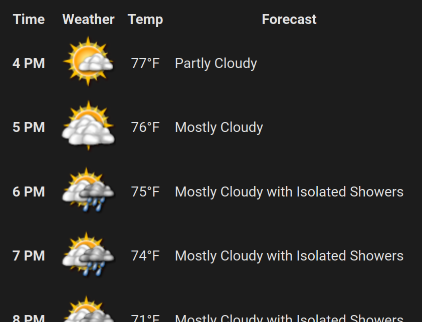

# Davis-HA
Integration of the Davis Vantage VUE weather station over MQTT with Home Assistant

This configuration is set up for personal use, so it's not fully optimized.

## WeeWX Setup

I have [WeeWX](https://weewx.com/) running on a headless [Raspberry
Pi](https://www.raspberrypi.com/) (**old** 1st revision, Model B, buster)
connected to the older [Davis
Vantage Vue](https://www.davisinstruments.com/pages/vantage-vue) console via
the WeatherLink USB Data Logger (6510USB). Configuration files that reside on
the this Raspbery Pi are located in the [weewx-host](weewx-host) directory. Home
Assistant is updated using the
[weewx-mqtt](https://github.com/matthewwall/weewx-mqtt) extension. I use a MySQL
database residing on an external server to minimize writes to the SD card. I
included udev rules so that the USB weatherlink is automatically attached to
/dev/davis.

In order to set up all the sensors on the Home Assistant host, I run the
ha-discovery.py script which publishes sensor configuration with the retain flag
for easy discovery. This allows all sensors to be linked under a common device
heading.


For forecasting, I upload my data to [PWS Weather](https://www.pwsweather.com/).
By uploading my data, I am able to use the [Xweather](https://www.xweather.com/)
API, but this is all done on the Home Assistant host as the RPi 1 struggles when
given too many tasks.

## Home Assistant Setup

Home Assistant is hosted on a virtual machine on Proxmox. My MQTT broker is run
through the official Home Assistant addon.

A rest sensor is set up to obtain hourly and daily forecasts from Xweather.
Since Xweather has its own
[icons](https://www.xweather.com/docs/weather-api/reference/icon-list) for
specific conditions, I found it easier and more informative to copy all of these
icons to my /config/www/xweather-icon folder and then use a specific xweather
frontend theme for any weather cards.

The template weather provider wraps the forecast info and appropriate sensor
info into a single weather entity. Other information is converted from the raw
weather station values using translations from the Davis Vantage Vue serial
communication manual and template sensors.



The above card is set up as follows:
```
show_current: true
show_forecast: true
type: weather-forecast
entity: weather.wombat_villa
tap_action:
  action: navigate
  navigation_path: /lovelace-weather/today-forecast
hold_action:
  action: navigate
  navigation_path: /lovelace-weather/extended-forecast
view_layout:
  position: sidebar
forecast_type: hourly
secondary_info_attribute: humidity
theme: xweather
```

Since I use a custom theme, the forecast from clicking on the card doesn't look
as nice. I therefore set up specific hourly and daily forecasts that how up when
either clicking or holding the weather card.

### Hourly Forecast

Located at /lovelace-weather/today-forecast:

```
type: markdown
card_size: 26
content: |-
  | Time || Weather || Temp || Forecast |
  |:-----:|-|:---------:|-|:-:|-|-----|
  
    | **{{ day.dateTimeISO | as_timestamp | timestamp_custom('%-I&nbsp;%p') }}** |&nbsp;|  |&nbsp;| {{ day.tempF }}°F |&nbsp;| {{ day.weather }} |
  
```



### Daily Forecast

Located at /lovelace-weather/extended-forecast:

```
type: markdown
card_size: 26
content: |-
  
    ## {{ day.dateTimeISO | as_timestamp | timestamp_custom('%A (%-m/%d)') }}
    ||||
    |-|-|-|
    ||&emsp;|{{ day.weather }}|

   | High || Low || Humidity || Precipitation || UVI |
   |:-----:|-|:-:|-|:---------:|-|:-:|-|:-----:|   
    | {{ day.maxTempF }}°F || {{ day.minTempF }}°F || {{ day.humidity }}% || {{ day['pop'] }}% || {{ day.uvi }}

    ---
  
```


